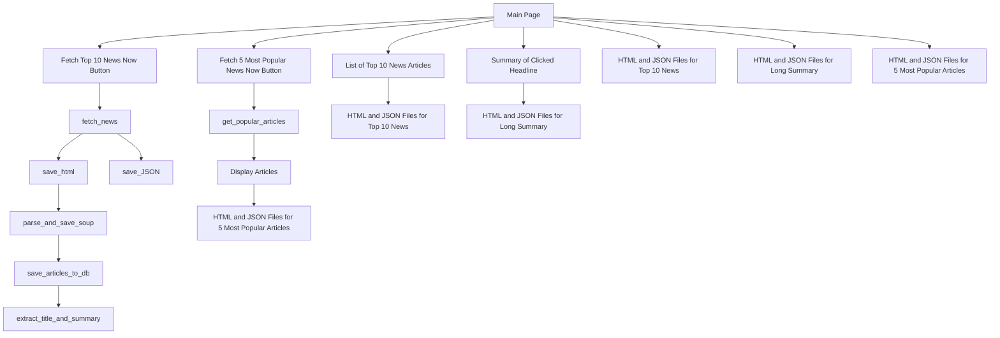

```mermaid
graph TD;
    A[Main Page] --> B[Fetch Top 10 News Now Button];
    A --> C[Fetch 5 Most Popular News Now Button];
    A --> D[List of Top 10 News Articles];
    A --> E[Summary of Clicked Headline];
    A --> F[HTML and JSON Files for Top 10 News];
    A --> G[HTML and JSON Files for Long Summary];
    A --> H[HTML and JSON Files for 5 Most Popular Articles];
    B --> I[fetch_news];
    I --> J[save_html];
    I --> K[save_JSON];
    J --> L[parse_and_save_soup];
    L --> M[save_articles_to_db];
    M --> N[extract_title_and_summary];
    C --> O[get_popular_articles];
    O --> P[Display Articles];
    P --> Q[HTML and JSON Files for 5 Most Popular Articles];
    D --> R[HTML and JSON Files for Top 10 News];
    E --> S[HTML and JSON Files for Long Summary];
```