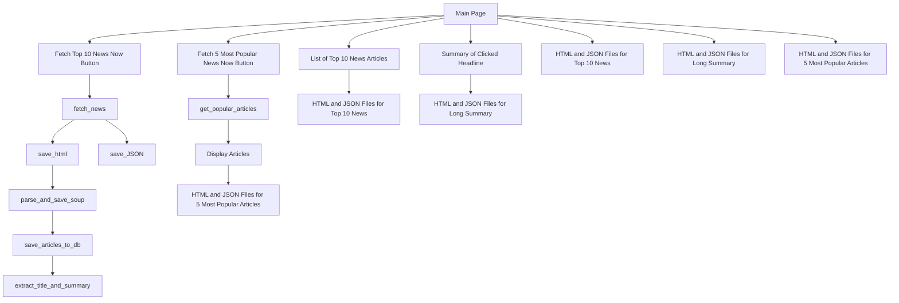

Rewrite the diagram to include
A main page with 2 columns and a sidebar 
The main page includes Fetch Top 10 News Now Button
The Sidebar contains a calendar with today's date as a default option and a Fetch 5 Most Popular News Now Button
The left column on the main page shows the list of top 10 news articles with the headline, a summary 150 signs and a call to read more at with the hyperlink of this article.
The right columns contains the summary of 3 sentences of the clicked headline on the left column
Once the top 10 news is fetched with the button it produces a list of headlines, 150 signs of summaries and a link to the article, which are saved in one HTML and one JSON text file.
The long summary on the right column of the main page gets  to be saved in another HTML and JSON file.
The 5 most popular articles list per calendar date of today or in the past is saved in an HTML and JSON file.
 

[fetch_news]
[save_html]
[save_JSON]
[parse_and_save_soup];
[get_popular_articles];
[Display Articles]
[save_articles_to_db];
[extract_title_and_summary];

To accurately represent the described user interface and interactions in a Mermaid.js diagram, we need to focus on the key components and their interactions. Here's a revised diagram that includes the main page, sidebar, and the interactions between the functions based on your description:

This diagram represents the following:
- The **Main Page** with two columns and a sidebar.
- The **Sidebar** contains a calendar with today's date as a default option and a "Fetch 5 Most Popular News Now Button".
- The **Left Column** on the main page shows the list of top 10 news articles with the headline, a 150-character summary, and a link to read more.
- The **Right Column** contains the summary of 3 sentences of the clicked headline on the left column.
- Once the top 10 news is fetched with the button, it produces a list of headlines, 150-character summaries, and a link to the article, which are saved in one HTML and one JSON text file.
- The long summary on the right column of the main page gets saved in another HTML and JSON file.
- The 5 most popular articles list per calendar date of today or in the past is saved in an HTML and JSON file.

This diagram provides a visual representation of the user interface and the interactions between the functions based on your description.